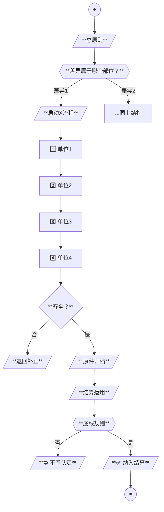

# Mermaid流程图样式规范（V7最终版）

> 适用于工程结算SOP类制度文件流程图。源自示例PPP项目实战蒸馏。

## 一、设计原则

1. **纵向Y型瀑布布局**（TB），非横向
2. **商务低饱和配色**，避免高饱和荧光色
3. **零emoji图标**，仅用形状+文字
4. **核心动词+主体加粗**（`**...**`）
5. **中高文字密度**（每节点3-4行）
6. **节点形状语义化**（6种）

## 二、节点形状（6种）

| 形状 | mermaid语法 | 用途 | 配色class |
|:---|:---|:---|:---|
| 起止 | `([...])` 体育场形 | 流程开始/结束 | `start` |
| 操作 | `[...]` 矩形 | 操作动作 | `normal` |
| 判断 | `{"..."}` 菱形 | 二选一/多选一 | `decision` |
| 关键判断 | `{{"..."}}` 六边形 | 核心分叉判断 | `keyDecision` |
| 汇总 | `[/.../]` 平行四边形 | 输入/汇总 | `summary` |
| 底线 | `{{"..."}}` 八边形 | 警示底线 | `critical` |

## 三、配色体系（9种classDef）

```css
classDef start fill:#FFFFFF,stroke:#5A6B7A,stroke-width:2.5px,color:#000
classDef principle fill:#FFFFFF,stroke:#5A6B7A,stroke-width:2.5px,color:#000
classDef decision fill:#FFF8DC,stroke:#D4A574,stroke-width:2.5px,color:#000
classDef keyDecision fill:#F5E6C8,stroke:#D4A574,stroke-width:3px,color:#000
classDef normal fill:#FFFFFF,stroke:#5A6B7A,stroke-width:2px,color:#000
classDef action fill:#FFFFFF,stroke:#31859C,stroke-width:2px,color:#000
classDef annotation fill:#F5F5DC,stroke:#8B8B5A,stroke-width:2px,color:#000
classDef warn fill:#FBE5D6,stroke:#C00000,stroke-width:2px,color:#5C0000
classDef result fill:#E2EFDA,stroke:#548235,stroke-width:2.5px,color:#1F3A0F
classDef summary fill:#FFFFFF,stroke:#31859C,stroke-width:2.5px,color:#000
classDef critical fill:#C00000,stroke:#5C0000,stroke-width:3px,color:#fff
classDef criticalBad fill:#FBE5D6,stroke:#C00000,stroke-width:2.5px,color:#5C0000
classDef criticalGood fill:#E2EFDA,stroke:#548235,stroke-width:3px,color:#1F3A0F
```

## 四、配色对照（色值+用途）

| 元素 | 填充色 | 边框色 | 视觉特征 |
|:---|:---|:---|:---|
| 常规节点 | #FFFFFF 白 | #5A6B7A 深灰蓝 | 商务白底 |
| 原则/汇总 | #FFFFFF 白 | #31859C 青蓝 | 重要但非决策 |
| 判断菱形 | #FFF8DC 浅黄 | #D4A574 橙黄 | 引导决策 |
| 关键判断（六边形） | #F5E6C8 米黄 | #D4A574 橙黄 | 突出核心分叉 |
| 注释/补充 | #F5F5DC 淡黄绿 | #8B8B5A 橄榄绿 | 辅助说明 |
| 操作/动作 | #FFFFFF 白 | #31859C 青蓝 | 流程推进 |
| 结果节点 | #E2EFDA 浅绿 | #548235 深绿 | 通过/完成 |
| 警示/补正 | #FBE5D6 浅红 | #C00000 深红 | 错误/退回 |
| **底线规则** | #C00000 深红 | #5C0000 暗红 | 强制警示 |
| 底线"是"分支 | #E2EFDA 浅绿 | #548235 深绿 | 通过 |
| 底线"否"分支 | #FBE5D6 浅红 | #C00000 深红 | 不通过 |

## 五、文字处理规范

### 5.1 加粗规则

| 位置 | 是否加粗 | 示例 |
|:---|:---:|:---|
| 总原则标题 | ✓ | `**总原则：所有工程量以竣工图为准**` |
| 关键判断问题 | ✓ | `**核对对象属于哪个部位？**` |
| 核心动词 | ✓ | `**按竣工图直接计量**` |
| 主体对象 | ✓ | `**四方签章缺一不可**` |
| 描述性文字 | ✗ | "管道长度、检查井数量" |

### 5.2 换行规则

- 用 `<br/>` 实现mermaid内换行
- 每节点3-4行为佳
- 不超过5行（避免过长）

### 5.3 引号规则

- 引用文件/制度名用书名号：`《工程量确认表》`
- 强调用`**...**`
- 不要在节点文字里用`""`（mermaid会解析错误）

## 六、连线规范

### 6.1 标签箭头

```mermaid
A -->|是| B
A -->|否| C
```

### 6.2 虚线/点线

```mermaid
A -.签认.-> B    # 虚线+标签
```

虚线用法：
- 签认关系（A签认B）
- 支撑关系（C支撑D）
- 补正回路（补正→重做）

## 七、布局规范

### 7.1 整体布局

```
[启动] → [原则] → [关键判断] → [3条支路] → [汇合] → [后续] → [结束]
         ↑            ↑             ↑          ↑         ↑
         顶部对齐    居中分叉     三列Y型    单列汇合   顺次下行
```

### 7.2 节点对齐

- 所有起止节点宽度一致
- 同类型节点宽度一致
- 用 `&nbsp;` 填充对齐（如需要）

## 八、模板代码（直接复用）

### 8.1 总图模板骨架

```mermaid
flowchart TB
    A([●]):::start
    A --> B[/"**总原则：XXX**"/]:::principle
    B --> C{{"**关键判断？**"}}:::keyDecision

    C -->|"分支1"| D1["..."]:::normal
    C -->|"分支2"| D2["..."]:::normal
    C -->|"分支3"| D3["..."]:::normal

    D1 --> ... --> 汇合
    D2 --> ... --> 汇合
    D3 --> ... --> 汇合

    汇合 --> 后续 → O([●]):::start

    classDef start fill:#FFFFFF,stroke:#5A6B7A,stroke-width:2.5px,color:#000
    ...
```

### 8.2 差异处理模板骨架



## 九、主题渲染（pretty-mermaid）

```bash
node pretty-mermaid/scripts/render.mjs \
    --input "流程图.mmd" \
    --output "流程图.png" \
    --theme zinc-light \
    --width 1800 \
    --format png
```

**推荐主题**：`zinc-light`（最接近参考图商务风）

## 十、反模式（绝对避免）

| ❌ 反模式 | ✅ 正确做法 |
|:---|:---|
| 🔵🟢🟠✅❌💰 emoji图标 | 仅用形状+文字 |
| 9种classDef配色 | 商务低饱和3-5色 |
| 横向LR布局 | 纵向TB布局 |
| 高饱和荧光色（#FF00FF） | 商务色（#5A6B7A） |
| 节点单行文字 | 节点3-4行中高密度 |
| 关键词未加粗 | 核心动词`**加粗**` |
| 连线密集交叉 | Y型瀑布汇合+虚线标识 |
| 节点宽度差异大 | 同类型节点宽度一致 |
